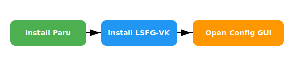

# 🖥️ LSFG-VK: Lossless Scaling Frame Generator for Vulkan
*A Complete Setup Guide for CachyOS & Arch Linux Users*

---

## 📌 Introduction

This repository contains a guide for setting up `lsfg-vk`, the Vulkan-based Lossless Scaling Frame Generator, tailored for **CachyOS** and **Arch Linux** users. This utility enhances your gaming and graphical experience by providing high-quality upscaling with minimal performance loss.

Whether you're gaming at a lower resolution or seeking a more efficient method of scaling without compromising on image clarity, **LSFG-VK** is your solution.

---

## 🎯 Features

- 🔍 Pixel-perfect integer scaling
- 🖼️ No blurry interpolation like bilinear or bicubic
- 🚀 Vulkan-based performance
- 🛠️ GUI-based configuration
- 🐧 100% Linux-native

---

## 🛠️ Step-by-Step Installation

### ✅ Step 1: Install Required Tools

Make sure you have [`paru`](https://wiki.archlinux.org/title/Paru) (an AUR helper) installed.

Then, install Lossless Scaling:

```bash
paru --needed lossless-scaling
```

If you don't have `paru`, install it with:

```bash
sudo pacman -S paru
```

### 📥 Step 2: Clone and Install LSFG-VK (if step one failed not recomended)

Clone the `lsfg-vk` repo from GitHub and compile it:

```bash
git clone https://github.com/lossless-scaling/lsfg-vk.git
cd lsfg-vk
make
sudo make install
```

> ⚠️ Ensure dependencies like `vulkan-headers`, `glslang`, and build tools are installed.

---

## 🧰 Configuration

Once installed, open the LSFG-VK configuration window:

```bash
lsfg-vk-ui
```

This will open the GUI to customize scaling settings.


Refer to the above screenshot to match your settings.

---

## 🖼️ SVG Explanation of Workflow

Here's a basic visual SVG representation of the process pipeline:




---

## 🧪 Tips & Troubleshooting

- ❌ GUI not launching?
  ```bash
  LSFG_VK_DEBUG=1 lsfg-vk --config
  ```
- 🖼️ Vulkan not working? Make sure your GPU supports Vulkan and proper drivers are installed.
- 🧼 Clean builds by running `make clean` before recompiling.

---

## 📜 License & Credits

- 🔗 You can also install it directly via Steam:
- 👉 [Lossless Scaling on Steam](https://store.steampowered.com/app/993090/Lossless_Scaling/)
- 📂 Project: [LSFG-VK GitHub]([https://github.com/lossless-scaling/lsfg-vk](https://github.com/PancakeTAS/lsfg-vk))
- 🤝 Community: Arch Wiki, CachyOS Users
- 🧑‍💻 Author: RSV

---

*Generated on August 06, 2025 — README designed for maximum clarity and appeal.*


---

## 📂 Additional Setup for Steam Users

To integrate **Lossless Scaling** with your Steam games:

📁 **Step 4: Move the `Lossless Scaling` Folder**

Place the `Lossless Scaling` folder inside your Steam installation directory:

```bash
mv ~/Downloads/Lossless\ Scaling ~/.local/share/Steam/steamapps/common/
```

> 📝 Make sure the folder is named exactly `Lossless Scaling`.

After placing it:
- You can configure it as a non-Steam game or link it with launch options.
- Great for Proton games or native titles requiring pixel-perfect scaling.
